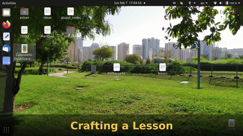
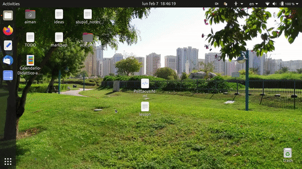

# Psittacus


<p>Psittacus iratus linguas docet 🦜</p>
<p><em>The angry parrot teaches languages 🦜</em></p>


## What is it?

Psittacus is a lightweight, open-source tool, meant to facilitate language-learning and teaching, and with a vision to empower teachers and learners of any written+spoken language around the world. 

Psittacus is based on the gamification of the sentence-mining approach, having an interface vaguely inspired by that of Duolingo and other competing interactive language learning-tools. 

Psittacus aims at democratizing the process of language-learning and teaching, making it easy for teachers to prepare and collaborate on their own lessons, and share them in a standardized and easily accessible format. 

## Whom does it appeal to?

* Language lovers in general. 🌍
* Teachers of any language that need to share quick homeworks/lessons with their students. 📚
* Speakers of endangered languages that wish to preserve and spread their native tounge. 🌱
* Conlangers that want the world to learn their constructed language. 🤓
* And many more...

## What are some of its main features?
* Simple interface for lang-teachers to prepare lessons.
* Possibility to edit and extend existing lessons.
* Lessons are stored in an easily shareable format. 
* Lessons can be taken fully offline, once downloaded/sideloaded.
* Support for audio playback of sentences.
* Support for hover-over-the-word definitions.


## Crafting a Lesson:

<a href="https://www.youtube.com/watch?v=-uog_4TvUDg" title="Click me!">
</img>
</a>

## Taking a Lesson:

<a href="https://www.youtube.com/watch?v=A1P5fVyRzfg" title="Click me!">
</img>
</a>


# Details

<details>
   <summary><strong>Lesson File Format</strong></summary>
   
   # Lesson File Format
   
  A 'lesson' comprises: sentence-pairs, word-definitions and audio-data. Each single lesson is made up of multiple 'propositions'. 
  Each proposition expresses an idea in two different languages. The information of a lesson is stored in the widely-known json format, 
  and can be shared as a simple text file. 
   
   
  ## The structure of a lesson-json is the following:
  
  ```   
   {   
        "target_language" : "target lang",
        "source_language" : "source lang",
        "author" : "author-or-authors",  
        "last_modified" : 1644144766547,
        "propositions" : [proposition1, proposition2, proposition3, ...]        
   }
  ```
  
  (More metadata may get added to lessons in the future).
   
  
  ## Each proposition has the following structure:
  
  ```
  {
   "sentence_one" : "ciao mondo",
   "sentence_two" : "hello world",
   "word_dict" : {"ciao":"hello", "mondo":"world"},
   "audio_base64" : "data:audio/mpeg;base64,GkXfo59ChoEBQveBAULygQRC84EIQoKEd2VibUK...",
   "target_to_native" : true
  }
  
  ```
   
   * sentence_one: the sentence in the **target language** (ie: the language the student wishes to learn).
   * sentence_two: the same idea expressed in the **student's language**.
   * audio_base64: the audio of sentence_one (in the **target language**) recorded by a native or proficient speaker. Encoded
   as audio-data in base-64. 
   * target_to_native: true if the user should be asked to translate from the target language to his/her native one, false otherwise.
   * word_dict: a dictionary that provides a brief description of each word contained in sentence_one. 
   
   #### Please note that: 
   
   * A 'word' here simply means: 'a string of unicode characters surrounded by spaces'. 
   
   * The definition can and should be made up of more words, and may eventually include a brief analysis of the grammar (tense, gender, case
   markings...) if that helps the student understand the context better. In more 'advanced' lessons, this brief definition may be provided in
   terms of the target language, for those who favor a full-immersion approach.
   
  
  
</details>

<details>
  <summary><strong>Code Organization</strong></summary>
  
  # Avoiding Name Conflicts

This website is being developed as an SPA <a target="_blank" href="https://it.wikipedia.org/wiki/Single-page_application">(Single Page Application)</a>, in light of making it easily downloadable, with as much functionality as possible available to the user offline. 
  
  
  Being the final product a single page, means that all html templates have to share the same namespace. The solution 
  currently being adopted to avoid naming conflicts is to have a **UNIQUE ID FOR EACH HTML ELEMENT**. 
  
  If you find/introduce any bugs, and are attempting to fix them, please consider checking for html element id conflicts.
    
  The convention that will be used in case of a naming conflict (two html elements with the same id) is to prepend the name    
  of the template to the id of the element. 
  
  Eg:
    
   ```
    <!--inside of the file 'take_lesson.html'-->
    <input id="button_play_audio" type="button"/>
      
    <!--Becomes: -->
    <input id="take_lesson_button_play_audio" type="button"/>
     
   ```
  
  And for javascript functions, to append the camelCase name of the module they're in:
  
  ```
  //inside of craft_lesson.js
  
  function displayProposition(proposition){
  /*...*/
  }
  
  // becomes:
 
  function displayPropositionCraftLesson(proposition){
  /*...*/
  }
  
  ```
  
  
</details>


<details>
  <summary><strong>Setting up a Local Testing Environment</strong></summary>

## 1) Clone this repo
...and navigate to its root directory.

## 2) Create a python virtual environment 
...calling it '.my_env' 

(For gitignore-related reasons).

```
$ python3 -m venv .my_env
```

(You'll be prompted to install the 'venv' module if you don't have it yet).

## 3) Activate the virtual environment:

```
$ source .my_env/bin/activate
```

If this command doesn't work try with:

```
$ . .my_env/bin/activate
```

(You should notice that the console starts displaying the virtual environment's name before your username and the dollar-sign).


## 4) Install this app's dependencies 
... on the virtual environment you just created:

```
(.my_env)$ pip install -r requirements.txt
```
## 5) Run the app on localhost!

```
(.my_env)$ python3 -m flask run
```

#### Sample output:

```
 * Environment: production
   WARNING: This is a development server. Do not use it in a production deployment.
   Use a production WSGI server instead.
 * Debug mode: off
 * Running on http://127.0.0.1:5000/ (Press CTRL+C to quit)
```

Click on the link, and the homepage will be launched on your default browser.

</details>


<details>
   <summary><strong>Experimental</strong></summary>
   
   # Automatic Lesson Generator:
   <a href="https://github.com/aiman-al-masoud/psittacus_automatic_lesson_generator">https://github.com/aiman-al-masoud/psittacus_automatic_lesson_generator</a>.

   
</details>


