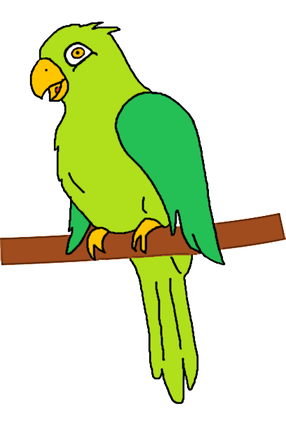

# favicon.png: 
(modified copy of the original)

https://pixabay.com/illustrations/parrot-bird-perched-drawing-art-6805595/

# home.png:

https://www.iconfinder.com/icons/1564508/home_main_room_estate_property_icon

## Author

https://www.iconfinder.com/Kh.Artyom

# play-audio.png:

https://www.iconfinder.com/icons/510856/audio_sound_speaker_volume_icon

## Author
https://www.iconfinder.com/iconify

# take-lesson.png:

https://www.iconfinder.com/icons/185072/read_book_icon

## Author
https://www.iconfinder.com/webalys

# history.png:

https://www.iconfinder.com/icons/8111410/history_time_clock_watch_timer_alarm_schedule_icon

## Author
https://www.iconfinder.com/kavithaharish

# edit-lesson.png:

https://www.iconfinder.com/icons/185042/edit_modify_icon

## Author
https://www.iconfinder.com/webalys

# create-lesson.png:

https://www.iconfinder.com/icons/3209309/architecture_brand_build_compass_create_icon

## Author
https://www.iconfinder.com/becris

# settings.png:

https://www.iconfinder.com/icons/185095/settings_icon

## Author
https://www.iconfinder.com/webalys

# info.png:

https://www.iconfinder.com/icons/172483/info_icon

## Author
"Visual Pharm"

# download.png:

https://www.iconfinder.com/icons/2931171/download_import_save_down_storage_icon

## Author
https://www.iconfinder.com/stefantaubert

# correct.mp3:
<audio src="correct.mp3">Audio</audio>

https://freesound.org/people/StavSounds/sounds/546081/

# wrong.mp3:
https://freesound.org/people/Raclure/sounds/483598/

# select.mp3:
https://freesound.org/s/413310/

